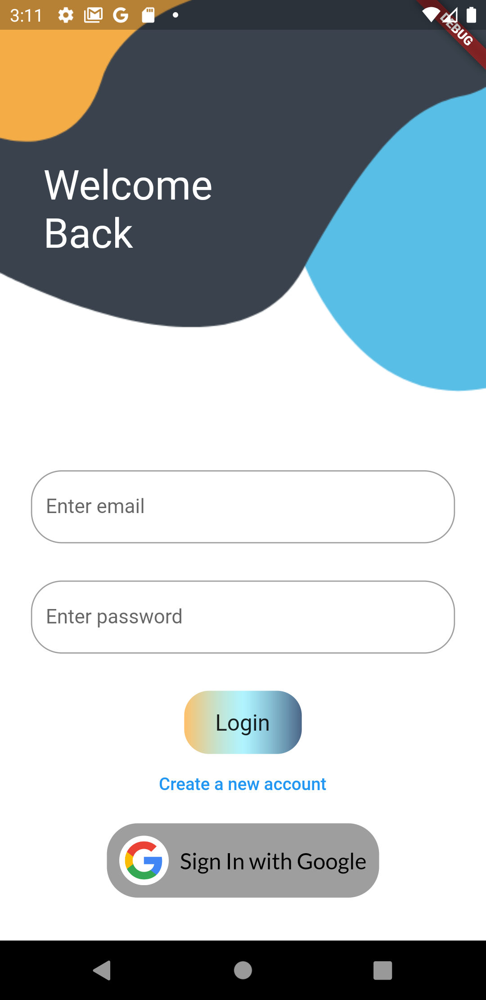
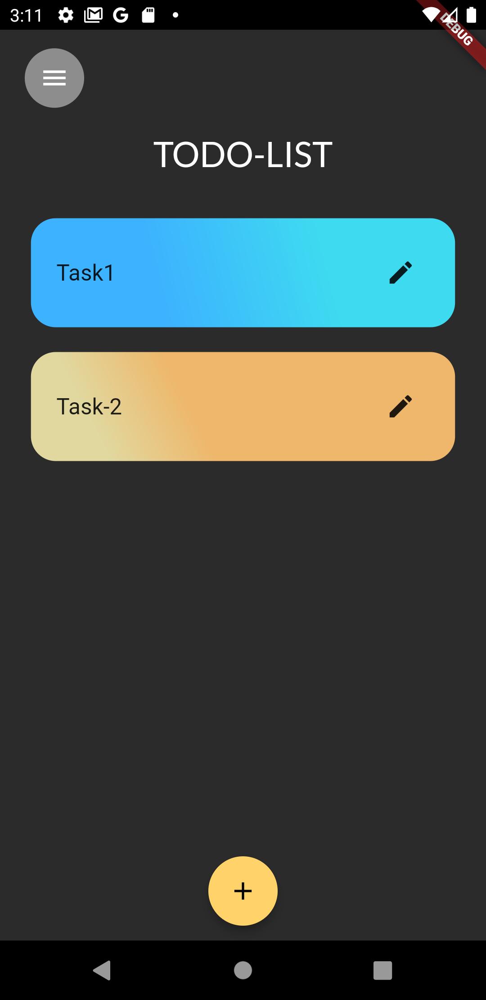

# TODO-App
The app uses firebase authentication as well as google sign-in and allows the user to add task,delete task and update task. Each and every task is stored in cloudstore firebase.

<!--  -->
<table>
  <tr>
    <td>Login Screen</td>
    <td> Task Screen </td>
    
   </tr>
  
   <tr>
     <td></td>
     <td>  </td>
  </tr>
 </table>
 

 
